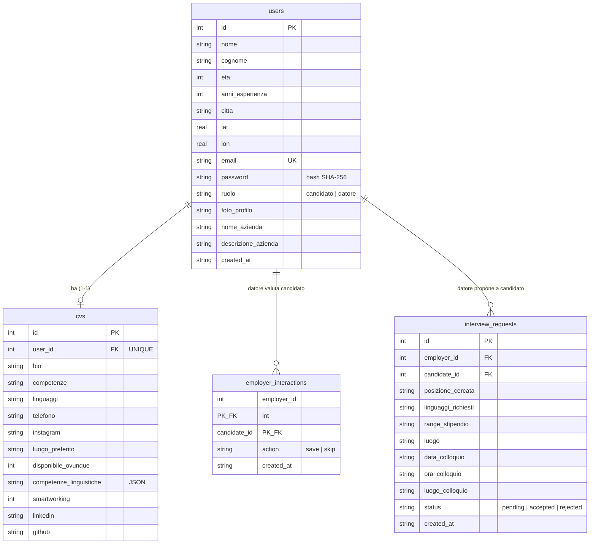

# Documentazione progetto DevCards

Il progetto DevCards e' stato sviluppato con l'obiettivo di creare un'app per il recruiting in stile "swipe": i candidati pubblicano una propria DevCard (un CV sintetico), mentre i datori di lavoro scorrono i profili, li salvano o li scartano e propongono colloqui. L'applicazione e' pensata per funzionare sia da web sia da mobile: il frontend Ionic/Angular gestisce l'interfaccia e la navigazione, mentre il backend Node.js/Express espone API REST in formato JSON e salva i dati su SQLite.

Durante lo sviluppo e' stata posta attenzione alla leggibilita' del codice, alla separazione delle responsabilita' e alla coerenza con lo stack richiesto. La logica e' divisa in pagine, componenti, servizi, guard e interceptor lato frontend; nel backend segue il flusso `routes -> controllers -> models -> db`.

Le funzionalita' principali offerte dal sistema sono:

- registrazione e login di due tipi di utente: candidato e datore di lavoro;
- compilazione e aggiornamento della DevCard del candidato (CV);
- scelta della posizione su mappa con geocodifica (Leaflet + Nominatim);
- caricamento della foto profilo da file o da fotocamera;
- feed "swipe" lato datore: salva o scarta i candidati;
- elenco dei candidati salvati, con filtri per linguaggio, citta', esperienza e lingua;
- proposta di colloquio dal datore al candidato;
- gestione dei colloqui ricevuti dal candidato (accetta / rifiuta);
- profilo aziendale del datore;
- profilo pubblico del candidato condivisibile tramite QR code;
- cambio password e recupero password demo.

Il sistema e' stato mantenuto entro un livello architetturale didattico: non sono stati introdotti ORM, state manager avanzati o servizi esterni obbligatori. Le funzionalita' sono implementate tramite componenti Angular standalone, servizi HTTP, controller Express e query SQLite.

## Stack utilizzato

Il frontend e' realizzato con Angular 18, Ionic Angular 8, TypeScript, RxJS e SCSS. Le pagine sono componenti standalone caricati con lazy loading tramite `loadComponent` nel file `src/app/app.routes.ts`. Per il supporto mobile viene usato Capacitor 6 (build Android), con i plugin Camera e Geolocation; le mappe usano Leaflet e i QR code la libreria `qrcode`.

Il backend usa Node.js, Express 5, CORS, SQLite (driver `sqlite3`), `jsonwebtoken` per i token JWT e il modulo nativo `crypto` per l'hashing SHA-256 delle password. Il server viene avviato da `backend/server.js` e ascolta di default sulla porta `3000`.

La comunicazione tra frontend e backend avviene tramite HTTP JSON. In sviluppo, sul web, il frontend usa il proxy definito in `frontend/proxy.conf.json`, che inoltra le chiamate `/api` a `http://localhost:3000`. Su mobile (app nativa Capacitor) i percorsi relativi non funzionano, quindi `ApiService` usa un URL assoluto preso da `environment.nativeApiUrl` (es. `http://10.0.2.2:3000` per l'emulatore Android).

## Architettura

Lo schema generale mostra i tre livelli (client, server, dati) e come sono collegati in sviluppo:

```text
                          DEVCARDS - ARCHITETTURA

  +---------------------------- CLIENT ----------------------------+
  |                                                                |
  |   WEB (browser :4200)                MOBILE (app Capacitor)    |
  |   Angular + Ionic                    stesso codice Angular     |
  |   ApiService.base = ''               ApiService.base =         |
  |   (percorsi relativi)                environment.nativeApiUrl  |
  |        |                                   |                   |
  |        | /api/...                          | http://IP:3000    |
  +--------|-----------------------------------|-------------------+
           |                                   |
           v                                   |
  +------------------+                         |
  | ng serve :4200   |  proxy.conf.json        |
  | (proxy /api ->   |-------------------+     |
  |  localhost:3000) |                   |     |
  +------------------+                   v     v
                                  +-------------------------+
                                  |   BACKEND Express :3000 |
                                  |                         |
                                  |  routes/ (sotto /api)   |
                                  |     |                   |
                                  |  controllers/  <-- JWT  |
                                  |     |        middleware |
                                  |  models/                |
                                  |     |                   |
                                  |  db.js                  |
                                  +-----------|-------------+
                                              |
                                              v
                                     +------------------+
                                     |  SQLite          |
                                     |  database.sqlite |
                                     +------------------+

  Flusso di una richiesta:
  Componente -> ApiService -> (proxy / URL nativo) -> route -> controller
             -> model -> db.js -> SQLite -> risposta JSON -> Observable -> UI
```

Il backend non serve il frontend: espone solo le API. Il frontend gira separatamente (web con `ng serve`, mobile come app nativa che incorpora la build).

Lo stesso viaggio di una richiesta, dall'utente fino al database e ritorno, in forma di diagramma di flusso:


> Lo stesso diagramma e' disponibile anche come codice Mermaid (per chi usa un visualizzatore che lo renderizza):
>
> ```mermaid
> flowchart TD
>     U([Utente]) --> R[Rotta Angular]
>     R -->|controlla il ruolo| G{Guard}
>     G -->|non autorizzato| L[redirect a /login]
>     G -->|ok| P[Component / Page]
>     P --> S[Service: ApiService]
>     S -->|legge base URL| E[Environment]
>     S --> I[Interceptor]
>     I -->|aggiunge token + no-cache| H[Richiesta HTTP /api/...]
>     H -->|CORS permette| RT[Rotta Express = Endpoint]
>     RT --> M[Middleware: verifica JWT]
>     M --> C[Controller]
>     C --> MO[Model]
>     MO --> DB[(SQLite)]
>     DB --> RES[risposta JSON]
>     RES -.ritorna al.-> P
> ```

## Avvio del progetto

Per avviare il backend:

```bash
cd backend
npm install
npm start
```

Il backend sara' disponibile su `http://localhost:3000`.

Per avviare il frontend:

```bash
cd frontend
npm install
npm start
```

Il frontend sara' disponibile su `http://localhost:4200`.

Servono quindi due processi attivi contemporaneamente (due terminali): il frontend ha bisogno del backend acceso per le API.

Credenziali demo candidato:

```txt
email: candidato@candidato.it
password: 1234
```

Credenziali demo datore:

```txt
email: datore@datore.it
password: 1234
```

Il database SQLite (`backend/database.sqlite`) viene creato e popolato automaticamente al primo avvio con utenti di esempio (lo schema e i dati mock sono in `backend/database.sqlite.sql`).

## Struttura del frontend

Il frontend e' organizzato per pagine, componenti riutilizzabili e servizi. Le rotte principali sono definite in `src/app/app.routes.ts`.

Il bootstrap dell'app avviene in `src/main.ts` tramite `bootstrapApplication(AppComponent)`. In questa fase vengono registrati:

- `provideIonicAngular({ animated: false })`, per usare Ionic in modalita' standalone (animazioni disattivate per maggiore reattivita');
- `provideRouter(routes)`, per il routing con lazy loading;
- `provideHttpClient(withInterceptors([authInterceptor, apiNoCacheInterceptor]))`, per usare `HttpClient` con gli interceptor funzionali;
- `IonicRouteStrategy`, come strategia di riuso route compatibile con Ionic;
- `defineCustomElements(window)`, per abilitare gli elementi PWA (es. fotocamera) di Ionic.

`AppComponent` e' volutamente minimale: contiene solo `ion-app` e `ion-router-outlet`, lasciando tutta la navigazione al router Angular.

Le rotte dell'app sono:

| Rotta | Pagina | Accesso |
|---|---|---|
| `login` | `LoginPage` | pubblica |
| `candidate` | `CandidateProfilePage` | `candidateGuard` |
| `candidate-home` | `CandidateHomePage` | `candidateGuard` |
| `employer` | `EmployerDiscoveryPage` | `employerGuard` |
| `employer-profile` | `EmployerProfilePage` | `employerGuard` |
| `employer-interviews` | `EmployerInterviewsPage` | `employerGuard` |
| `saved` | `SavedDevcardsPage` | `employerGuard` |
| `public-profile/:id` | `PublicProfilePage` | pubblica |
| `''` e `**` | redirect a `login` | - |

I servizi principali sono `ApiService` (chiamate HTTP centralizzate), `AuthService` (sessione su `localStorage`), `GeocodeService` (Nominatim) e `ProfileEventsService` (sincronizzazione della DevCard tra pagine). Gli interceptor sono `authInterceptor` (token) e `apiNoCacheInterceptor` (anti-cache). Tutti vengono descritti in dettaglio nelle sezioni successive.

## Dettaglio tecnico del frontend

Questa sezione descrive, servizio per servizio, pagina per pagina e componente per componente, le proprieta' e i metodi principali, cosi' da rendere chiaro cosa fa ogni file.

### Servizi (metodo per metodo)

**ApiService (`services/api.service.ts`)** - centralizza tutte le chiamate al backend. Ha la proprieta' `base` (indirizzo del backend: relativo sul web, assoluto su mobile) e il metodo privato `url(path)` che compone l'indirizzo completo. Poi un metodo per ogni endpoint:

- `register(payload)`, `login(email, password)`, `recoverPassword(email)`, `changePassword(old, new)` - autenticazione e account.
- `getDevcards()`, `interact(candidate_id, action)`, `removeInteraction(candidate_id)`, `getSavedDevcards(filters)` - feed e preferiti del datore.
- `getCv(userId)`, `saveCv(payload)` - lettura e salvataggio della DevCard.
- `proposeInterview(payload)`, `getCandidateInterviews()`, `setInterviewStatus(id, status)`, `getEmployerInterviews()` - colloqui.
- `getEmployer(id)`, `getEmployerProfile()`, `saveEmployerProfile(payload)` - profilo azienda.
- `getServerIp()` - IP del server per il QR.

**AuthService (`services/auth.service.ts`)** - gestisce la sessione salvata in `localStorage`.

- `getUser()` / `setUser(user)` - leggono/salvano l'utente.
- `getToken()` / `setToken(token)` - leggono/salvano il token.
- `patchUser(patch)` - aggiorna alcuni campi dell'utente salvato.
- `clear()` - cancella la sessione (logout).
- `isLoggedIn()` - dice se c'e' utente e token.
- `isCandidate()` / `isEmployer()` - dicono il ruolo.
- `isEmployerProfileComplete(user)` - dice se il profilo aziendale e' completo.

**GeocodeService (`services/geocode.service.ts`)**

- `search(query)` - da un testo (citta') ottiene coordinate e nome del luogo (Nominatim).
- `reverse(lat, lon)` - da coordinate ottiene la citta' e il nome del luogo.

**ProfileEventsService (`services/profile-events.service.ts`)**

- `publishCard(card)` - "annuncia" la DevCard aggiornata; le pagine in ascolto su `card$` la ricevono e si aggiornano (sincronizza la home del candidato dopo una modifica al CV).

### LoginPage (`login/login.page.ts`)

Gestisce sia il login sia la registrazione con due variabili di stato: `mode` (`'login' | 'register'`) e `role` (`'candidato' | 'datore'`). Mantiene inoltre l'oggetto `reg` con i campi del form di registrazione, la `fotoProfilo` (data URL) e lo stato del modale di recupero password.

Metodi:

- `showRegister()` / `showLogin()`: cambiano `mode` per alternare i due form.
- `onLocation(loc)`: riceve l'evento del `MapPickerComponent` e salva `lat`, `lon` e, se presente, `citta` nell'oggetto `reg`.
- `takePhoto()`: usa l'utility `capturePhoto()` (plugin Capacitor Camera) per scattare una foto e salvarla come data URL.
- `onFotoSelected(event)`: gestisce il caricamento da file; chiama `resizeImage()` per ridimensionare l'immagine, con fallback su `FileReader` se il ridimensionamento fallisce.
- `resizeImage(file, maxSize, quality)`: ridimensiona l'immagine via `canvas` mantenendo le proporzioni (lato massimo 512px, qualita' JPEG 0.85), restituendo un data URL.
- `login()`: chiama `ApiService.login()`; al successo salva token e utente con `AuthService`. Se l'utente e' candidato, carica il CV e va a `/candidate-home` se completo, altrimenti a `/candidate`; se e' datore, va a `/employer` se il profilo aziendale e' completo, altrimenti a `/employer-profile`.
- `register()`: costruisce il payload con i campi comuni e, solo per il candidato, aggiunge eta', esperienza, citta', coordinate, bio, linguaggi, contatti e foto; poi chiama `ApiService.register()` e torna al login.
- `openRecover()` / `closeRecover()`: aprono e chiudono il modale di recupero.
- `recover()`: chiama `ApiService.recoverPassword()` e mostra il messaggio del server (la password viene reimpostata a `123456`).

### CandidateProfilePage (`candidate-profile/candidate-profile.page.ts`)

E' il form della DevCard (CV). Mantiene l'oggetto `cv` con i campi del CV, `citta`/`lat`/`lon` per la posizione, l'array `lingue` (lingua + livello), l'anteprima foto e il flag `submitted` per la validazione.

Metodi:

- `ngOnInit()`: legge l'utente da `AuthService`, chiama `loadProfile()` e si iscrive agli eventi del router per ricaricare il profilo quando si rientra sulla rotta `/candidate`.
- `ngOnDestroy()`: annulla la sottoscrizione al router.
- `loadProfile()`: imposta l'anteprima (foto o avatar) e carica il CV con `getCv()`, passando il risultato a `populate()`.
- `populate(data)`: riempie i campi del form; fa il parsing di `competenze_linguistiche` (JSON) per popolare l'array `lingue`; se non c'e' CV usa i dati base dell'utente.
- `addLingua(lingua, livello)` / `removeLingua(index)`: gestiscono l'elenco delle lingue parlate (livelli da A1 a C2).
- `onLocation(loc)`: aggiorna citta' e coordinate dalla mappa.
- `takePhoto()`, `onFotoSelected()`, `resizeImage()`: gestione foto, come in `LoginPage`.
- `isMissing(field)`: indica se un campo obbligatorio (bio, competenze, linguaggi, luogo preferito) e' vuoto dopo l'invio, per evidenziarlo nel template.
- `save()`: valida i campi obbligatori, serializza le lingue in JSON, invia il payload con `saveCv()`; al successo aggiorna i dati locali dell'utente (`patchUser`), ricarica la DevCard fresca e la pubblica con `ProfileEventsService`, poi va a `/candidate-home`.
- `logout()`: pulisce la sessione e torna a `/login`.

### CandidateHomePage (`candidate-home/candidate-home.page.ts`)

Mostra la DevCard dell'utente, un QR code per il profilo pubblico e i colloqui ricevuti.

Metodi:

- `ngOnInit()`: legge l'utente, si iscrive a `profileEvents.card$` (per ricevere la card aggiornata), carica colloqui e DevCard.
- `loadCard()`: carica il CV con `getCv()`; se non e' completo reindirizza a `/candidate`; altrimenti costruisce l'URL pubblico e pubblica la card.
- `buildPublicUrl()`: costruisce il link al profilo pubblico. Se l'app gira su `localhost`/`127.0.0.1`, chiama `getServerIp()` per sostituire l'host con l'IP di rete locale, cosi' il QR e' raggiungibile da altri dispositivi sulla stessa rete.
- `loadInterviews()`: carica i colloqui ricevuti con `getCandidateInterviews()`.
- `respond(interview, status)`: accetta o rifiuta un colloquio con `setInterviewStatus()`, poi ricarica l'elenco.
- `companyName(iv)`: ricava il nome azienda da mostrare.
- `openCompany(iv)` / `closeCompany()`: caricano e mostrano la scheda azienda con `getEmployer()`.
- `formatDate(value)` / `formatTime(value)`: formattano data e ora del colloquio.
- `openPasswordModal()`: apre il modale di cambio password.
- `printCard()`: aggiunge una classe CSS dedicata e lancia `window.print()` per stampare la DevCard, ripulendo lo stato a stampa conclusa.
- `logout()`.

### EmployerDiscoveryPage (`employer-discovery/employer-discovery.page.ts`)

E' il feed "swipe" del datore. Mantiene l'array `candidates`, l'`index` corrente, la classe di animazione `swipeClass` e lo stato del profilo aperto.

Metodi:

- `ngOnInit()`: se il profilo aziendale non e' completo reindirizza a `/employer-profile`; altrimenti carica i candidati e si iscrive al router per ricaricare il feed al rientro su `/employer`.
- `loadCards()`: carica la pila con `getDevcards()`.
- `current` (getter): il candidato attualmente mostrato; `finished` (getter): vero quando la pila e' esaurita.
- `handle(action)`: gestisce lo swipe. Imposta la classe di animazione (`swipe-right` per salva, `swipe-left` per scarta), registra l'azione con `interact()` e, dopo 300ms, avanza al candidato successivo.
- `openProfile(card)` / `closeProfile()`: aprono e chiudono il profilo completo (`FullProfileComponent`).
- `openPasswordModal()`: apre il modale di cambio password.
- `logout()`.

### SavedDevcardsPage (`saved-devcards/saved-devcards.page.ts`)

Elenca i candidati salvati e permette di filtrarli, rimuoverli e proporre colloqui. Mantiene `cards`, l'oggetto `filters`, lo stato del profilo aperto, lo stato del modale colloquio e l'oggetto `iv` con i dati della proposta.

Metodi:

- `ngOnInit()`: controllo profilo, imposta `minDate` a domani, carica i salvati e si iscrive al router.
- `tomorrow()`: restituisce la data di domani in formato `YYYY-MM-DD` (usata come data minima del colloquio).
- `load()`: carica i salvati con `getSavedDevcards(filters)`.
- `applyFilters()`: riapplica i filtri ricaricando l'elenco.
- `openProfile(card)` / `closeProfile()`: profilo completo.
- `removeCard(card)`: dopo conferma, rimuove dai preferiti con `removeInteraction()` e ricarica.
- `openInterview(card)` / `closeInterview()`: aprono e chiudono il modale di proposta colloquio, precompilando id e nome candidato.
- `submitInterview()`: valida che la data sia successiva a oggi, poi invia la proposta con `proposeInterview()` e mostra l'esito.
- `logout()`.

### EmployerInterviewsPage (`employer-interviews/employer-interviews.page.ts`)

Mostra i colloqui inviati dal datore.

Metodi:

- `ngOnInit()`: controllo profilo, carica i colloqui con `getEmployerInterviews()`.
- `counts` (getter): conta i colloqui per stato (`pending`, `accepted`, `rejected`) con `reduce`.
- `avatar(iv)`: restituisce la foto del candidato o un avatar generato (DiceBear).
- `formatDate(value)` / `formatTime(value)`: formattazione.
- `logout()`.

### EmployerProfilePage (`employer-profile/employer-profile.page.ts`)

Form del profilo aziendale.

Metodi:

- `ngOnInit()`: carica il profilo con `getEmployerProfile()`.
- `onLocation(loc)`: aggiorna citta' e coordinate dalla mappa.
- `save()`: invia il profilo con `saveEmployerProfile()`, aggiorna la sessione (`patchUser`) e reindirizza a `/employer`.
- `logout()`.

### PublicProfilePage (`public-profile/public-profile.page.ts`)

Pagina pubblica aperta dal QR.

Metodi:

- `ngOnInit()`: legge l'`id` dalla rotta e carica il CV con `getCv(id)`, gestendo gli stati di caricamento ed errore. Il profilo viene mostrato tramite `FullProfileComponent`.

### Componenti riutilizzabili

#### AppHeaderComponent (`components/app-header`)

Intestazione condivisa con titolo, sottotitolo (`@Input subtitle`) e uno slot `ng-content` per i pulsanti.

- `ngAfterViewInit()`: pubblica l'altezza dell'header e osserva i cambi di dimensione con `ResizeObserver` e l'evento `resize`.
- `publishHeight()`: scrive l'altezza nella variabile CSS `--app-header-height`, usata dal layout per non sovrapporre il contenuto all'header.
- `ngOnDestroy()`: disconnette observer e listener.

#### ChangePasswordModalComponent (`components/change-password-modal`)

Modale per il cambio password (template inline).

- `open()` / `close()`: mostrano e nascondono il modale; `reset()` azzera i campi.
- `submit()`: controlla che nuova password e conferma coincidano, poi chiama `changePassword()` e mostra il messaggio del server o l'errore.

#### MapPickerComponent (`components/map-picker`)

Mappa Leaflet per scegliere una posizione. Inputs: `lat`, `lon`, `zoom`, `readOnly`, `popupText`, `placeholder`, `inputName`, `initialCity`. Output: `locationChange` (evento `MapLocation`).

- `ngAfterViewInit()`: crea la mappa Leaflet, aggiunge il tile layer OpenStreetMap, gestisce il click sulla mappa (posiziona il marker e fa reverse geocoding) e, se forniti, centra su `lat`/`lon`. Chiama `invalidateSize()` per il corretto rendering.
- `placeMarker(lat, lng, recenter)`: posiziona o sposta il marker; il marker e' trascinabile e al `dragend` rifa il reverse geocoding.
- `reverseGeocode(lat, lon)`: usa `GeocodeService.reverse()` per ottenere la citta' e il nome del luogo, poi emette `locationChange`.
- `search()`: cerca una citta' con `GeocodeService.search()` e posiziona il marker.
- `useMyLocation()`: usa il plugin Capacitor Geolocation per centrare sulla posizione attuale.
- `onSearchEnter(event)`: invio da tastiera nel campo di ricerca.
- `ngOnDestroy()`: rimuove la mappa.

#### DevcardComponent (`components/devcard`)

Card grafica del candidato. Inputs: `card` (obbligatorio), `showDistance`, `includeBack`, `qrData`.

- `ngOnChanges()`: quando cambia `qrData` rigenera il QR.
- `generateQr()`: usa `QRCode.toDataURL()` per creare l'immagine del QR (colori a tema, correzione errori alta).
- `toggleFlip()`: gira la card (fronte/retro) se `includeBack` e' attivo.
- Getter: `avatar`, `city`, `languages` (linguaggi di programmazione, max 6), `spokenLanguages` (lingue parlate), `contacts` (telefono, email, LinkedIn, GitHub).
- `onContact(event, contact)`: mostra il contatto in un alert.

#### FullProfileComponent (`components/full-profile`)

Vista completa del profilo candidato, usata nel feed e nel profilo pubblico. Input: `card`.

- Getter: `avatar`, `name`, `programmingLanguages`, `spokenLanguages`, `availability` (combina disponibilita' ovunque, smartworking, luogo preferito), `details` (esperienza, citta', distanza, disponibilita') e `contacts`.
- `profileHref(value)`: normalizza un URL di contatto aggiungendo `https://` se manca.

### Utility condivise

- `shared/devcard-utils.ts`: `splitCsv()` (divide stringhe separate da virgola), `parseSpokenLanguages()` (parsing del JSON delle lingue), `getCandidateName()`, `getAvatar()` (foto o avatar DiceBear), `isCandidateCvComplete()` (verifica che il CV abbia bio, competenze, linguaggi e luogo/disponibilita'), e la costante `CARD_LANGUAGE_LIMIT`.
- `shared/photo.util.ts`: `capturePhoto()` usa il plugin Capacitor Camera per scattare una foto (qualita' 85, larghezza 512, risultato come data URL).

## Interceptor

Gli interceptor sono funzioni (`HttpInterceptorFn`) registrate in `main.ts`.

### authInterceptor (`interceptors/auth.interceptor.ts`)

Per ogni richiesta verso un URL che contiene `/api/`, se esiste un token in sessione lo aggiunge come header `Authorization: Bearer <token>`. Inoltre intercetta gli errori: se la risposta e' `401` (token mancante, scaduto o non valido), pulisce la sessione con `AuthService.clear()` e reindirizza l'utente a `/login`. Questo centralizza l'autenticazione: le pagine non gestiscono manualmente il token ne' la disconnessione su sessione scaduta.

### apiNoCacheInterceptor (`interceptors/api-no-cache.interceptor.ts`)

Per le sole richieste `GET` verso `/api/`, aggiunge un parametro `_ts` con il timestamp corrente e gli header `Cache-Control: no-cache` e `Pragma: no-cache`. Serve a evitare che il browser (o eventuali proxy) restituiscano risposte vecchie dalla cache: ogni GET e' cosi' sempre "fresca". Le richieste non-GET passano invariate.

## Guard

Le guard (`guards/candidate.guard.ts` e `guards/employer.guard.ts`) sono funzioni `CanActivateFn` basate su `inject()`.

- `candidateGuard`: lascia passare solo se l'utente e' loggato ed e' un candidato (`auth.isLoggedIn() && auth.isCandidate()`); altrimenti restituisce un redirect a `/login` (`router.parseUrl('/login')`).
- `employerGuard`: stessa logica, ma per il ruolo datore.

Questa separazione impedisce a un candidato di aprire le pagine del datore e viceversa, mantenendo distinti i due flussi anche a livello di routing.

## Geocodifica e mappe

La scelta della posizione e' affidata al `MapPickerComponent` (Leaflet) e al `GeocodeService`, che interroga Nominatim di OpenStreetMap.

- `GeocodeService.search(query)`: chiama l'endpoint `search` di Nominatim e restituisce latitudine, longitudine e nome del luogo del primo risultato.
- `GeocodeService.reverse(lat, lon)`: chiama l'endpoint `reverse` e ricava la citta' (provando `city`, `town`, `village`, `municipality`) e il nome completo del luogo.

Entrambi inviano un header `User-Agent: DevCards/1.0`, come richiesto dalle buone pratiche di Nominatim. La mappa permette tre modi per scegliere il punto: click sulla mappa, trascinamento del marker e ricerca testuale della citta'; in piu', su mobile, il pulsante "Usa la mia posizione" usa il GPS via Capacitor Geolocation. Lato backend, l'utility `geo.js` usa la stessa logica per geocodificare la citta' quando mancano le coordinate (in registrazione e nel salvataggio di CV e profilo azienda) e calcola la distanza tra datore e candidato con la formula di Haversine.

## Gestione delle foto

La foto profilo puo' essere fornita in due modi:

- da file: `onFotoSelected()` legge il file e chiama `resizeImage()`, che usa un `canvas` per ridimensionare l'immagine a un lato massimo di 512px e comprimerla in JPEG (qualita' 0.85), riducendo molto il peso del data URL; se il ridimensionamento fallisce, c'e' un fallback con `FileReader` che invia l'immagine originale;
- da fotocamera: `capturePhoto()` (utility condivisa) usa il plugin Capacitor Camera con larghezza 512 e qualita' 85, restituendo direttamente un data URL.

La foto viaggia come stringa data URL (`data:image/...;base64,...`) ed e' per questo che il backend imposta un limite generoso al body JSON (`express.json({ limit: '50mb' })`). I candidati senza foto ottengono un avatar generato automaticamente da DiceBear a partire da nome e cognome. Il backend valida che, se presente, la foto sia effettivamente un'immagine in formato data URL.

## Riepilogo degli endpoint (riferimento rapido)

Questa sezione raccoglie tutti gli endpoint in forma di tabella, come indice rapido (corrisponde al file `API.md`). I dettagli con esempi di richiesta/risposta sono nelle sezioni successive.

In due parole: il frontend chiama sempre indirizzi `/api/...` tramite `ApiService`; in sviluppo, sul web, il proxy li inoltra al backend su `:3000`; su mobile viene usato l'URL assoluto `nativeApiUrl`. La richiesta segue poi il percorso rotta -> controller -> model -> SQLite. Legenda colonna "Token": `no` = pubblica, `si` = serve il JWT (tra parentesi il ruolo atteso).

### 1. Autenticazione e account

| Metodo | Endpoint | Token | Quando / dove si usa |
|---|---|---|---|
| POST | `/api/register` | no | Schermata di registrazione: crea un account (candidato o datore). |
| POST | `/api/login` | no | Schermata di login: restituisce i dati utente + il token JWT. |
| POST | `/api/recover-password` | no | "Password dimenticata": reimposta la password a `123456`. |
| PUT | `/api/change-password` | si | Modale "Password": cambia la password attuale. |

### 2. CV del candidato (DevCard)

| Metodo | Endpoint | Token | Quando / dove si usa |
|---|---|---|---|
| GET | `/api/cv/:userId` | no | Profilo pubblico (es. aperto via QR): mostra il CV di un candidato. |
| POST | `/api/cv` | si (candidato) | Pagina profilo candidato: salva/aggiorna il proprio CV. |

### 3. Feed e preferiti (lato datore, lo "swipe")

| Metodo | Endpoint | Token | Quando / dove si usa |
|---|---|---|---|
| GET | `/api/devcards` | si (datore) | Schermata scoperta: la pila di candidati da valutare. |
| POST | `/api/interact` | si (datore) | Quando si salva o si scarta un candidato. |
| DELETE | `/api/interact` | si (datore) | Quando si rimuove un candidato dai salvati. |
| GET | `/api/devcards/saved` | si (datore) | Pagina "Preferiti": candidati salvati, con filtri. |

### 4. Colloqui

| Metodo | Endpoint | Token | Quando / dove si usa |
|---|---|---|---|
| POST | `/api/interview` | si (datore) | Propone un colloquio a un candidato. |
| GET | `/api/employer/interviews` | si (datore) | Pagina "Colloqui" del datore: quelli inviati. |
| GET | `/api/candidate/interviews` | si (candidato) | Home candidato: i colloqui ricevuti. |
| PUT | `/api/interview/status` | si (candidato) | Accetta o rifiuta un colloquio ricevuto. |

### 5. Profilo azienda

| Metodo | Endpoint | Token | Quando / dove si usa |
|---|---|---|---|
| GET | `/api/employer/:id` | no | Scheda pubblica di un'azienda. |
| GET | `/api/employer-profile` | si (datore) | Pagina "Azienda": legge il proprio profilo. |
| POST | `/api/employer-profile` | si (datore) | Pagina "Azienda": salva nome, descrizione, citta'. |

### 6. Utility

| Metodo | Endpoint | Token | Quando / dove si usa |
|---|---|---|---|
| GET | `/api/server-ip` | no | IP locale del server, per QR validi in rete locale. |
| GET | `/` | no | Health check: risponde "DevCards backend attivo". |

In totale **19 endpoint API** (+ l'health check `/`). Nota: `GET /api/employer/interviews` e' registrato prima di `GET /api/employer/:id`, cosi' "interviews" non viene interpretato come un id.

## API: autenticazione

Tutte le rotte sono sotto `/api`. Le rotte protette richiedono l'header `Authorization: Bearer <token>` ottenuto al login. Di seguito, per ogni endpoint, un esempio reale di richiesta e risposta.

### POST /api/register

Crea un nuovo account. La risposta e' `201`.

```json
// richiesta (candidato)
{
  "ruolo": "candidato",
  "nome": "Test", "cognome": "User",
  "email": "test@example.com", "password": "pass123",
  "eta": 30, "anni_esperienza": 5,
  "citta": "Milano", "lat": 45.46, "lon": 9.19,
  "bio": "Sviluppatore", "linguaggi": "JS",
  "telefono": "3331234567", "linkedin": "", "github": "",
  "foto_profilo": null
}
// risposta 201
{ "message": "Registrazione completata", "userId": 63 }
```

### POST /api/login

Restituisce i dati utente e il token JWT (valido 24h).

```json
// richiesta
{ "email": "datore@datore.it", "password": "1234" }
// risposta 200
{
  "message": "Login effettuato",
  "user": {
    "id": 32, "nome": "Datore", "cognome": "Speciale",
    "email": "datore@datore.it", "ruolo": "datore",
    "lat": 45.46, "lon": 9.19, "citta": "Milano",
    "nome_azienda": "SpecialeTech Inc.", "descrizione_azienda": "Test"
  },
  "token": "eyJhbGciOiJIUzI1NiIsInR5cCI6Ik..."
}
// risposta 400 (password errata)
{ "error": "Credenziali non valide" }
```

### POST /api/recover-password

```json
// richiesta
{ "email": "candidato@candidato.it" }
// risposta 200
{ "message": "Password reimpostata a: 123456. Usala per accedere e poi cambiala." }
// risposta 404 (email inesistente)
{ "error": "Email non trovata nel sistema" }
```

### PUT /api/change-password  (auth)

```json
// richiesta
{ "old_password": "1234", "new_password": "nuova123" }
// risposta 200
{ "message": "Password modificata con successo!" }
// risposta 400 (password attuale errata)
{ "error": "La password attuale non e' corretta" }
```

## API: DevCard (CV del candidato)

### GET /api/cv/:userId  (pubblica)

Restituisce la DevCard di un candidato (usata anche dal profilo pubblico via QR).

```json
// risposta 200 (estratto)
{
  "id": 1, "nome": "Candidato", "cognome": "Speciale",
  "eta": 25, "anni_esperienza": 3, "citta": "Milano",
  "linguaggi": "JS,TS", "competenze": "Node",
  "competenze_linguistiche": "[]",
  "smartworking": 1, "disponibile_ovunque": 0,
  "foto_profilo": null, "bio": "Dev"
}
// risposta 404
{ "error": "Candidato non trovato" }
```

### POST /api/cv  (auth, candidato)

Crea o aggiorna la DevCard.

```json
// richiesta
{
  "bio": "Dev fullstack", "competenze": "Node, Angular",
  "linguaggi": "JS, TS", "telefono": "3331234567",
  "instagram": "", "linkedin": "", "github": "",
  "luogo_preferito": "Milano", "citta": "Milano",
  "lat": 45.46, "lon": 9.19, "disponibile_ovunque": 0,
  "competenze_linguistiche": "[{\"lingua\":\"Inglese\",\"livello\":\"B2\"}]",
  "smartworking": 1, "foto_profilo": null
}
// risposta 200
{
  "message": "CV aggiornato con successo",
  "foto_profilo": null, "citta": "Milano", "lat": 45.46, "lon": 9.19
}
```

## API: discovery e preferiti (datore)

### GET /api/devcards  (auth, datore)

Feed dei candidati non ancora valutati, con `distanza` calcolata.

```json
// risposta 200 (primo elemento)
{
  "id": 4, "nome": "Anna", "cognome": "Bianchi",
  "eta": 24, "anni_esperienza": 2, "citta": "Torino",
  "linguaggi": "JavaScript, HTML, CSS, Vue.js",
  "competenze": "UI/UX, CSS, Responsive Design",
  "competenze_linguistiche": "[{\"lingua\":\"Inglese\",\"livello\":\"B1\"}]",
  "smartworking": 1, "disponibile_ovunque": 0,
  "distanza": "125 km", "foto_profilo": null,
  "bio": "Frontend Developer junior con forte senso estetico."
}
// risposta 401 (senza token)
{ "error": "Token di autenticazione mancante" }
```

### POST /api/interact  (auth, datore)

Registra uno swipe (salva o scarta).

```json
// richiesta
{ "candidate_id": 4, "action": "save" }
// risposta 200
{ "message": "Azione registrata" }
```

### GET /api/devcards/saved  (auth, datore)

Candidati salvati, con filtri opzionali in query string: `linguaggio`, `citta`, `anniExpMin`, `lingua`. La risposta ha la stessa forma di un elemento del feed.

```txt
GET /api/devcards/saved?linguaggio=JavaScript&citta=Torino&anniExpMin=2&lingua=Inglese
```

### DELETE /api/interact  (auth, datore)

```json
// richiesta
{ "candidate_id": 4 }
// risposta 200
{ "message": "Candidato rimosso dai preferiti" }
```

## API: colloqui

### POST /api/interview  (auth, datore)

Propone un colloquio. La data deve essere futura.

```json
// richiesta
{
  "candidate_id": 1, "posizione_cercata": "Full Stack Developer",
  "linguaggi_richiesti": "JS, TS", "range_stipendio": "30-40k",
  "luogo": "Milano", "data_colloquio": "2026-12-31",
  "ora_colloquio": "15:00", "luogo_colloquio": "Sede Milano"
}
// risposta 201
{ "message": "Richiesta di colloquio inviata" }
// risposta 400 (data non futura)
{ "error": "La data del colloquio deve essere successiva a quella corrente" }
```

### GET /api/employer/interviews  (auth, datore)

Colloqui inviati, con i dati del candidato.

```json
// risposta 200 (primo elemento)
{
  "id": 12, "employer_id": 32, "candidate_id": 1,
  "posizione_cercata": "Full Stack Developer",
  "linguaggi_richiesti": "JS, TS", "range_stipendio": "30-40k",
  "luogo": "Milano", "data_colloquio": "2026-12-31",
  "ora_colloquio": "15:00", "luogo_colloquio": "Sede Milano",
  "status": "pending", "created_at": "2026-06-29 21:52:13",
  "candidato_nome": "Candidato", "candidato_cognome": "Speciale",
  "candidato_citta": "Milano", "foto_profilo": null
}
```

### GET /api/candidate/interviews  (auth, candidato)

Colloqui ricevuti, con i dati dell'azienda.

```json
// risposta 200 (primo elemento)
{
  "id": 12, "employer_id": 32, "candidate_id": 1,
  "posizione_cercata": "Full Stack Developer",
  "data_colloquio": "2026-12-31", "ora_colloquio": "15:00",
  "luogo_colloquio": "Sede Milano", "status": "pending",
  "azienda_nome": "Datore", "azienda_cognome": "Speciale",
  "azienda_citta": "Milano", "nome_azienda": "SpecialeTech Inc.",
  "descrizione_azienda": "Software house", "distanza": "0 km"
}
```

### PUT /api/interview/status  (auth, candidato)

```json
// richiesta
{ "interview_id": 12, "status": "accepted" }
// risposta 200
{ "message": "Colloquio accettato" }
// risposta 400 (stato non valido)
{ "error": "Parametri non validi" }
```

## API: profilo azienda

### GET /api/employer/:id  (pubblica)

```json
// risposta 200
{
  "id": 32, "nome": "Datore", "cognome": "Speciale",
  "citta": "Milano", "lat": 45.4642, "lon": 9.19,
  "nome_azienda": "SpecialeTech Inc.", "descrizione_azienda": "Software house"
}
```

### GET /api/employer-profile  (auth, datore)

Stessa forma della scheda pubblica, ma riferita al datore loggato.

### POST /api/employer-profile  (auth, datore)

```json
// richiesta
{
  "nome_azienda": "SpecialeTech Inc.",
  "descrizione_azienda": "Software house",
  "citta": "Milano", "lat": 45.4642, "lon": 9.19
}
// risposta 200
{
  "message": "Profilo azienda aggiornato con successo!",
  "citta": "Milano", "lat": 45.4642, "lon": 9.19,
  "nome_azienda": "SpecialeTech Inc.", "descrizione_azienda": "Software house"
}
```

## API: utility

### GET /api/server-ip  (pubblica)

```json
// risposta 200
{ "ip": "localhost" }
```

Restituisce l'IP locale del server; la home del candidato lo usa per costruire un QR raggiungibile in rete locale. La rotta `/` risponde con un health check: `{ "message": "DevCards backend attivo" }`.

## Dettaglio tecnico del backend (funzione per funzione)

Il backend segue il flusso `routes -> controllers -> models -> db`. Di seguito ogni file con le sue funzioni, descritte in modo semplice (una riga ciascuna).

### server.js

Entry point: configura CORS (accetta richieste da qualsiasi origine), abilita la lettura del corpo JSON (limite 50mb per le foto base64), monta le sei aree di rotte sotto `/api`, espone `GET /` come health check; infine, in una funzione `async`, verifica la connessione al DB, inizializza il database e mette il server in ascolto sulla porta `3000`. Non serve il frontend.

### db.js (connessione SQLite)

- `all(sql, params)` - esegue una query e restituisce piu' righe (array).
- `get(sql, params)` - esegue una query e restituisce una sola riga.
- `run(sql, params)` - esegue INSERT/UPDATE/DELETE; restituisce `lastID` e `changes`.
- `exec(sql)` - esegue uno script SQL con piu' comandi (usato per creare le tabelle).
- `raw` - la connessione grezza a SQLite, esposta per usi particolari.

### config/

- `initDb.js` -> `initDatabase()`: all'avvio crea le tabelle (idempotente) e inserisce i dati di esempio solo la prima volta (se la tabella `users` e' vuota).
- `jwt.js`: esporta le costanti `JWT_SECRET` (chiave segreta) e `JWT_EXPIRES_IN` (durata 24h), in un punto unico.

### middleware/

- `authMiddleware.js` -> `authenticateToken(req, res, next)`: legge il token da `Authorization: Bearer`, lo verifica; se manca o non e' valido risponde `401`, altrimenti mette `id`, `ruolo`, `email` in `req.user` e lascia proseguire.

### routes/

Collegano metodo + indirizzo al metodo del controller corrispondente (vedi la sezione "Riepilogo degli endpoint" per l'elenco completo): `authRoutes`, `cvRoutes`, `devcardRoutes`, `interviewRoutes`, `employerRoutes`, `miscRoutes`.

### controllers/

**authController.js**

- `sha256(s)` - funzione di aiuto: calcola l'hash SHA-256 di una stringa (per le password).
- `register(req, res)` - registra un utente: controlla email duplicata, cifra la password, geocodifica la citta' se serve, crea l'utente e l'eventuale CV iniziale.
- `login(req, res)` - verifica email e password (confronto degli hash) e, se ok, firma e restituisce il token JWT.
- `recoverPassword(req, res)` - se l'email esiste, reimposta la password a `123456`.
- `changePassword(req, res)` - cambia la password: verifica quella attuale e impone almeno 6 caratteri.

**cvController.js**

- `getCv(req, res)` - restituisce la DevCard (CV) di un candidato dato l'id; pubblica.
- `saveCv(req, res)` - crea o aggiorna il CV del candidato loggato: salva citta'/coordinate (geocodificando se mancano), salva la foto se valida, poi insert o update del CV.

**devcardController.js**

- `withDistance(cards, lat, lon, remoteLabel)` - funzione di aiuto: aggiunge a ogni card il campo `distanza` ("Remoto", "N km", oppure niente).
- `getDevcards(req, res)` - restituisce il feed dei candidati da valutare, con la distanza dal datore.
- `interact(req, res)` - registra l'azione del datore su un candidato: `save` o `skip`.
- `removeInteraction(req, res)` - rimuove un candidato dai salvati.
- `getSavedDevcards(req, res)` - restituisce i candidati salvati applicando i filtri e la distanza.

**interviewController.js**

- `proposeInterview(req, res)` - crea una proposta di colloquio: controlla i campi obbligatori e che la data sia futura.
- `getCandidateInterviews(req, res)` - colloqui ricevuti dal candidato, con la distanza dall'azienda.
- `setInterviewStatus(req, res)` - imposta lo stato (`accepted`/`rejected`), ma solo se il colloquio e' indirizzato a quel candidato.
- `getEmployerInterviews(req, res)` - colloqui inviati dal datore.

**employerController.js**

- `getEmployer(req, res)` - dati pubblici di un'azienda dato l'id.
- `getEmployerProfile(req, res)` - profilo aziendale del datore loggato.
- `saveEmployerProfile(req, res)` - salva nome azienda, descrizione e citta' (geocodificando se mancano le coordinate).

**miscController.js**

- `getServerIp(req, res)` - restituisce l'IP locale del server (per i QR validi in rete locale).

### models/

**userModel.js** (tabella `users`)

- `findByEmail(email)` - cerca un utente per email.
- `findById(id)` - cerca un utente per id.
- `findByIdAndRole(id, ruolo)` - cerca un utente per id e ruolo.
- `getCoords(id)` - restituisce solo latitudine e longitudine.
- `create(u)` - inserisce un nuovo utente e restituisce l'id.
- `updatePasswordById(id, hash)` / `updatePasswordByEmail(email, hash)` - aggiornano la password.
- `updatePhoto(id, foto)` - aggiorna la foto profilo.
- `updateLocation(id, citta, lat, lon)` - aggiorna citta' e coordinate.
- `updateCoords(id, lat, lon)` - aggiorna solo le coordinate.
- `getEmployerById(id)` - dati pubblici di un datore.
- `updateEmployerProfile(id, ...)` - aggiorna nome azienda, descrizione, citta' e coordinate.

**cvModel.js** (tabella `cvs`)

- `getByUserId(userId)` - DevCard completa unendo `users` e `cvs`.
- `findByUserId(userId)` - la sola riga del CV (per sapere se esiste).
- `insertOnRegister(userId, ...)` - inserisce un CV minimo in registrazione.
- `insert(c)` - inserisce un CV completo.
- `update(c)` - aggiorna un CV esistente.

**devcardModel.js** (interazioni e feed)

- `getFeed(employerId)` - candidati non ancora valutati dal datore, in ordine casuale.
- `getSaved(employerId, filters)` - candidati salvati, con i filtri opzionali.
- `upsertInteraction(employerId, candidateId, action)` - inserisce o aggiorna l'azione save/skip.
- `removeSave(employerId, candidateId)` - cancella il salvataggio di un candidato.

**interviewModel.js** (tabella `interview_requests`)

- `create(i)` - inserisce una nuova proposta di colloquio.
- `getByCandidate(candidateId)` - colloqui ricevuti, con i dati dell'azienda.
- `getByEmployer(employerId)` - colloqui inviati, con i dati del candidato.
- `updateStatus(interviewId, status, candidateId)` - aggiorna lo stato solo se il colloquio appartiene a quel candidato.

### utils/

- `geo.js` -> `geocodeCity(cityName)` (citta' -> coordinate via Nominatim), `haversineDistance(lat1, lon1, lat2, lon2)` (distanza in km).
- `net.js` -> `localIp()` (primo IPv4 locale della macchina, o "localhost").
- `validators.js` -> `isDataImage(foto)` (e' un'immagine data URL?), `getLocalDateValue(date)` (data come `AAAA-MM-GG`), `isValidDateValue(v)` (data valida?), `isFutureDateValue(v)` (data valida e futura?).

## Modello dati

Il database SQLite contiene quattro tabelle. Le foreign key sono attive (`PRAGMA foreign_keys = ON`), quindi cancellando un utente vengono rimossi a cascata CV, interazioni e colloqui collegati.



In sintesi:

- `users` raccoglie sia candidati sia datori, distinti dal campo `ruolo`. I campi azienda (`nome_azienda`, `descrizione_azienda`) sono valorizzati solo per i datori.
- `cvs` e' la DevCard del candidato, in relazione 1-a-1 con `users` (`user_id` unico).
- `employer_interactions` e' lo storico degli swipe, con chiave primaria composta `(employer_id, candidate_id)`: un datore ha una sola interazione per candidato.
- `interview_requests` sono le proposte di colloquio, con stato che evolve da `pending` ad `accepted`/`rejected`.

## Sicurezza e scelte progettuali

- Le password non sono mai salvate in chiaro: vengono cifrate con SHA-256.
- Le rotte sensibili sono protette da JWT; il token contiene solo `id`, `ruolo` ed `email` e dura 24 ore.
- Le guard lato frontend separano i flussi candidato e datore; gli interceptor centralizzano token e gestione della sessione scaduta.
- CORS e' abilitato lato backend (`origin: *`) con header ammessi `Content-Type` e `Authorization`.
- Frontend e backend restano separati: il backend espone solo le API, il frontend gira separatamente (web su `:4200` con proxy, mobile con URL assoluto). Questo mantiene chiari i confini tra interfaccia e dati.
